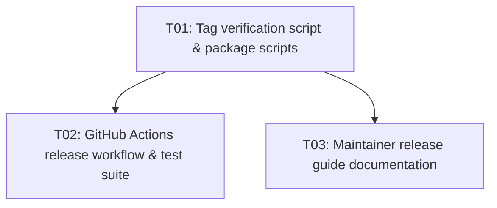

# Implementation plan — prd-05-automacao-de-release-e-publicacao

## Stable sources

- PRD: [`tasks/prd-05-automacao-de-release-e-publicacao/prd.md`](prd.md)
- TechSpec: [`tasks/prd-05-automacao-de-release-e-publicacao/techspec.md`](techspec.md)

> Common sources come before the task and mutable state; read order does not guarantee a cache hit.

## Dependency graph

| ID | Delivery | Depends on | Unblocks |
| --- | --- | --- | --- |
| T01 | Tag verification script `scripts/check-release-tag.ts`, `package.json` scripts (`release:check`, `release:verify-tag`), and unit tests | — | T02, T03 |
| T02 | GitHub Actions release workflow `.github/workflows/release.yml` with provenance publishing, release creation, and structure tests | T01 | — |
| T03 | Maintainer release guide `docs/release-guide.md` with credentials setup, 2FA, release steps, and boundary checks | T01 | — |

## Traceability matrix

| Source ID | Source section | Obligation | Tasks | Evidence or test |
| --- | --- | --- | --- | --- |
| FR-01 | `prd.md#functional-requirements` | Workflow de release no GitHub Actions (`release.yml`) disparado por tag `v*.*.*` e `workflow_dispatch` | T02 | `tests/unit/release-workflow.test.ts` |
| FR-02 | `prd.md#functional-requirements` | Validação rigorosa pré-publicação no pipeline (build, checks, schemas, testes, coverage, smoke) | T02 | `tests/unit/release-workflow.test.ts` |
| FR-03 | `prd.md#functional-requirements` | Validação de consistência estrita entre Git Tag e `package.json` `"version"` | T01 | `tests/unit/check-release-tag.test.ts` |
| FR-04 | `prd.md#functional-requirements` | Publicação autenticada no npm com Provenance via OIDC e `NODE_AUTH_TOKEN: ${{ secrets.NPM_TOKEN }}` | T02 | `tests/unit/release-workflow.test.ts` |
| FR-05 | `prd.md#functional-requirements` | Criação automática de GitHub Release com notas geradas | T02 | `tests/unit/release-workflow.test.ts` |
| FR-06 | `prd.md#functional-requirements` | Script de checagem pré-release no `package.json` (`npm run release:check`) | T01 | `npm run release:check`, `package.json` |
| FR-07 | `prd.md#functional-requirements` | Guia operacional de release e configuração de secrets (`docs/release-guide.md`) | T03 | `docs/release-guide.md`, package smoke |
| NFR-01 | `prd.md#non-functional-requirements` | Segurança de credenciais (sem vazamento em logs, escopo mínimo OIDC) | T02, T03 | `tests/unit/release-workflow.test.ts`, `docs/release-guide.md` |
| NFR-02 | `prd.md#non-functional-requirements` | Integridade do pacote npm (sem arquivos uncompiled TS ou diretórios proibidos) | T01, T03 | `npm run package:smoke` |
| NFR-03 | `prd.md#non-functional-requirements` | Idempotência e tratamento de erro explícito em caso de colisão de versão | T02, T03 | `tests/unit/release-workflow.test.ts`, `docs/release-guide.md` |
| NFR-04 | `prd.md#non-functional-requirements` | Desempenho e confiabilidade da esteira CI (`ubuntu-latest`, < 5 min) | T02 | `tests/unit/release-workflow.test.ts` |
| DEC-01 | `techspec.md#technical-decisions` | Single-job GitHub Actions workflow com permissões mínimas (`contents: write`, `id-token: write`) | T02 | `tests/unit/release-workflow.test.ts` |
| DEC-02 | `techspec.md#technical-decisions` | Script TypeScript `scripts/check-release-tag.ts` para validação de tag | T01 | `tests/unit/check-release-tag.test.ts` |
| DEC-03 | `techspec.md#technical-decisions` | npm Provenance via `setup-node` e `--provenance` | T02 | `tests/unit/release-workflow.test.ts` |
| DEC-04 | `techspec.md#technical-decisions` | GitHub Release via `gh release create` nativo | T02 | `tests/unit/release-workflow.test.ts` |
| DEC-05 | `techspec.md#technical-decisions` | Scripts `release:check` e `release:verify-tag` em `package.json` | T01 | `package.json`, unit tests |
| DEC-06 | `techspec.md#technical-decisions` | `docs/release-guide.md` mantido fora do pacote npm publicado | T03 | `npm run package:smoke` |
| DEC-07 | `techspec.md#technical-decisions` | Teste automatizado de estrutura do workflow em `tests/unit/release-workflow.test.ts` | T02 | `vitest run tests/unit/release-workflow.test.ts` |
| TC-01 | `techspec.md#test-approach` | Tag matching aceita com exit code 0 | T01 | `tests/unit/check-release-tag.test.ts` |
| TC-02 | `techspec.md#test-approach` | Tag mismatch rejeitada com exit code 1 | T01 | `tests/unit/check-release-tag.test.ts` |
| TC-03 | `techspec.md#test-approach` | Tag malformada rejeitada com exit code 1 | T01 | `tests/unit/check-release-tag.test.ts` |
| TC-04 | `techspec.md#test-approach` | Tag prerelease tratada via environment variable | T01 | `tests/unit/check-release-tag.test.ts` |
| TC-05 | `techspec.md#test-approach` | Asserções de estrutura, triggers e permissões de `release.yml` | T02 | `tests/unit/release-workflow.test.ts` |
| TC-06 | `techspec.md#test-approach` | Execução integrada de `release:check` | T01 | `npm run release:check` |
| TC-07 | `techspec.md#test-approach` | Guia operacional completo e pacote limpo | T03 | `docs/release-guide.md`, `npm run package:smoke` |

## Tasks

- [T01 — Tag verification script and package scripts](done/task_01.md): implement `scripts/check-release-tag.ts`, register `release:check` and `release:verify-tag` in `package.json`, and verify with unit tests in `tests/unit/check-release-tag.test.ts`.
- [T02 — GitHub Actions release workflow and structure tests](done/task_02.md): create `.github/workflows/release.yml` with triggers, full pre-release gate, npm provenance publish, GitHub release creation, and verify with unit tests in `tests/unit/release-workflow.test.ts`.
- [T03 — Maintainer release guide documentation](done/task_03.md): create `docs/release-guide.md` with complete instructions for npm tokens, GitHub secrets, 2FA, release steps, and boundary verification.

## Coverage gate

- Coverage: pass (all FR-01–FR-07 and NFR-01–NFR-04 mapped to tasks T01–T03).
- Traceability: pass (every requirement, decision, component, and test case is mapped).
- Dependencies: pass (acyclic DAG: T01 unblocks T02 and T03).
- Atomicity: pass (each task is a single vertical slice with implementation and tests).
- Executability: pass (all commands exist in `package.json` and `AGENTS.md`).
- Validation profile: pass (unit tests, integration check with `release:check`, and package smoke test; no CLI runtime binary change so CLI QA does not apply).
- Idempotency: pass (tasks can be re-run safely without corrupting state).

## Assumptions and open items

- Assumption: The maintainer will configure repository secret `NPM_TOKEN` on GitHub before pushing a version tag.
- Open item: None blocking.
- Required environment: Standard Node 20+ environment; GitHub Actions environment with OIDC for production publishing.

## State

- [x] T01 — completed
- [x] T02 — completed
- [x] T03 — completed

## Problems and solutions

- **PS-01 (ESLint ignores for non-source folders)**: Pre-existing `.mjs` scripts in `tasks/prd-03-plano-checkpoint-e-boot/qa_01/evidence/` were causing 14 `no-undef` lint errors during `npm run lint`. Added `'tasks/**'` and `'.agents/**'` to `ignores` in `eslint.config.js` to ensure the pre-release lint gate checks only real project source and test files.
