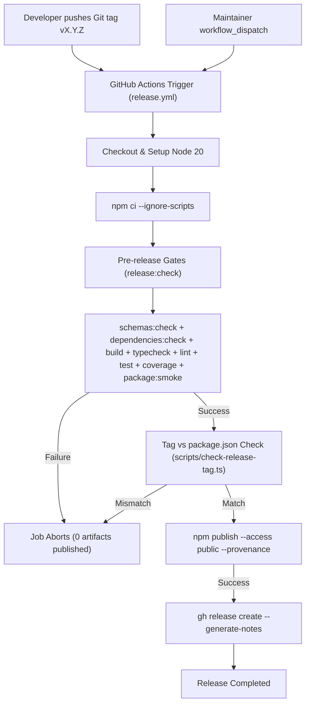

# TechSpec — prd-05-automacao-de-release-e-publicacao

## Sources and traceability

- PRD: [`tasks/prd-05-automacao-de-release-e-publicacao/prd.md`](prd.md)
- Applicable instructions, rules, and skills:
  - `AGENTS.md`
  - `.agents/rules/code-standards.md`
  - `.agents/rules/javascript-typescript.md`
  - `.agents/rules/node.md`
  - `.agents/rules/tests.md`
  - `sdd-create-techspec`
  - `sdd-plan-tasks`
- Research and project references:
  - `.github/workflows/ci.yml` (existing CI pipeline and validation matrix)
  - `scripts/check-package.ts` (npm packaging integrity rules)
  - `package.json` (npm scripts, package entrypoint, and engines)
  - [npm Provenance documentation](https://docs.npmjs.com/generating-provenance-statements)
  - [GitHub Actions OIDC with npm](https://docs.github.com/en/actions/deployment/security-hardening-your-deployments/about-security-hardening-with-openid-connect)

## Solution summary

This feature implements an automated, secure, and reproducible release and publication pipeline for ContextBrake. The pipeline is orchestrated via a GitHub Actions workflow (`.github/workflows/release.yml`) triggered on version tags (`v*.*.*`) or manually via `workflow_dispatch`.

Before publishing to the public npm registry, the workflow executes a rigorous sequential pre-release gate running all checks (`schemas:check`, `dependencies:check`, `build`, `typecheck`, `lint`, `test`, `coverage`, `package:smoke`), followed by an automated verification script (`scripts/check-release-tag.ts`) that guarantees exact synchronization between the Git tag and the `package.json` `"version"`. Upon gate approval, publication is executed with npm Provenance (`--provenance`) using GitHub Actions OIDC and the repository secret `NPM_TOKEN`. A GitHub Release is then created automatically using the GitHub CLI with auto-generated release notes. A local composite script (`npm run release:check`) and comprehensive maintainer documentation (`docs/release-guide.md`) complete the release toolchain.

## Technical decisions

| ID | PRD obligations | Decision | Reason and evidence | Alternatives and trade-offs |
| --- | --- | --- | --- | --- |
| DEC-01 | FR-01, NFR-01, NFR-04 | Single-job GitHub Actions workflow (`.github/workflows/release.yml`) on `ubuntu-latest` with minimal scoped permissions (`contents: write`, `id-token: write`). | Minimizes job scheduling overhead, avoids multi-job artifact upload latency, and finishes well within the 5-minute requirement (NFR-04). Restricting permissions enforces least privilege (NFR-01). | Multi-job workflow (build job + publish job); rejected because transferring artifacts adds complexity and latency without security benefit when publication requires built assets. |
| DEC-02 | FR-03, TC-01, TC-02, TC-03, TC-04 | Implement tag consistency verification via dedicated TypeScript script `scripts/check-release-tag.ts` rather than inline shell script. | A TypeScript script can be executed across platforms (Windows/Linux/macOS), handles SemVer validation robustly, produces clear diagnostic errors, and is unit-tested locally with 100% coverage. | Shell script in GitHub Actions step; rejected because bash parameter expansion is harder to test locally on Windows and lacks unit test traceability. |
| DEC-03 | FR-04, NFR-01 | Configure npm publication using `actions/setup-node@v4` with `registry-url: 'https://registry.npmjs.org'` and publish via `npm publish --access public --provenance`. | Generates cryptographic provenance attestation via Sigstore/SLSA using GitHub Actions OIDC (`id-token: write`). Authentication uses `NODE_AUTH_TOKEN: ${{ secrets.NPM_TOKEN }}` with GitHub Actions secret masking. | Traditional token-only publish without provenance; rejected because provenance is an explicit PRD requirement (OBJ-02, FR-04). |
| DEC-04 | FR-05 | Create GitHub Releases via GitHub CLI (`gh release create "${TAG}" --title "${TAG}" --generate-notes`). | `gh` is native to GitHub Actions runners, requires no third-party actions, handles automatic changelog generation natively, and uses standard `env: GH_TOKEN: ${{ github.token }}` with `contents: write`. | Third-party GitHub Action (e.g. `softprops/action-gh-release`); rejected to eliminate external action supply-chain dependencies. |
| DEC-05 | FR-06 | Register `release:check` and `release:verify-tag` scripts in `package.json`. | Enables maintainers to run the full pre-release test suite locally before pushing tags, preventing broken release attempts (OBJ-03, FR-06). | Relying solely on CI; rejected because early local feedback prevents polluting repository tags with failed attempts. |
| DEC-06 | FR-07, NFR-02 | Place `docs/release-guide.md` in repository documentation without adding it to npm package `files` in `package.json`. | Keeps npm package distribution bundle focused strictly on runtime code, schemas, and protocol files per NFR-02 and `scripts/check-package.ts`. | Including guide in npm package; rejected as unnecessary maintenance overhead in published tarball. |
| DEC-07 | NFR-01, NFR-03, TC-05 | Unit test `.github/workflows/release.yml` structure and step assertions in `tests/unit/release-workflow.test.ts`. | Validates that workflow triggers, permissions, steps, and options match PRD requirements deterministically in CI without requiring real secrets or live npm publishing during local development. | Relying only on live manual testing on GitHub; rejected because automated CI regressions could break release configuration undetected. |

## Components and flow

| ID | Component | New or modified | Responsibility | Dependencies |
| --- | --- | --- | --- | --- |
| CMP-01 | `.github/workflows/release.yml` | New | GitHub Actions workflow automating validation, tag checking, provenance publishing, and release creation. | CMP-02, CMP-03 |
| CMP-02 | `scripts/check-release-tag.ts` | New | Validates that target tag follows `v*.*.*` and matches `package.json` `"version"`. | `package.json` |
| CMP-03 | `package.json` | Modified | Defines `release:check` and `release:verify-tag` scripts. | Existing npm scripts |
| CMP-04 | `docs/release-guide.md` | New | Comprehensive guide for maintainers covering tokens, secrets, 2FA, release steps, and troubleshooting. | CMP-01, CMP-02 |
| CMP-05 | `tests/unit/check-release-tag.test.ts` | New | Unit tests for tag verification script across all match, mismatch, and error cases. | CMP-02 |
| CMP-06 | `tests/unit/release-workflow.test.ts` | New | Unit tests validating workflow YAML structure, permissions, and step sequences. | CMP-01 |

### Flow Diagram



## Contracts and data

### `scripts/check-release-tag.ts` Interface

- **Input sources**:
  1. CLI argument `--tag <tag>` (highest precedence)
  2. Environment variable `GITHUB_REF_NAME` (GitHub Actions tag ref name)
  3. Environment variable `TAG_NAME`
- **Validation rules**:
  - Tag must start with `v` followed by valid SemVer (e.g. `v1.0.0`, `v1.0.0-beta.1`).
  - Extracted version (`tag.slice(1)`) must strictly equal `package.json` `"version"`.
- **Exit codes**:
  - `0`: Success (tag and `package.json` version match).
  - `1`: Failure (missing tag, invalid format, or version mismatch).
- **Diagnostics**: Writes informative message to stdout on success, stderr on failure.

### `package.json` Scripts Modification

```json
{
  "scripts": {
    "release:verify-tag": "tsx scripts/check-release-tag.ts",
    "release:check": "npm run schemas:check && npm run dependencies:check && npm run build && npm run typecheck && npm run lint && npm test && npm run coverage && npm run package:smoke"
  }
}
```

### GitHub Actions Workflow Specification (`.github/workflows/release.yml`)

- **Name**: `Release`
- **Triggers**:
  - `push.tags: ['v[0-9]+.[0-9]+.[0-9]+*']`
  - `workflow_dispatch.inputs.tag: { description: 'Git tag to release', required: false, type: 'string' }`
- **Permissions**:
  - `contents: write` (for GitHub Releases)
  - `id-token: write` (for npm Provenance OIDC attestation)
- **Environment**:
  - Runner: `ubuntu-latest`
  - Node: `20`
  - Step environment variables:
    - Publish step: `NODE_AUTH_TOKEN: ${{ secrets.NPM_TOKEN }}`
    - Release step: `GH_TOKEN: ${{ github.token }}`

## Integrations and interfaces

- **npm Registry**:
  - Registry URL: `https://registry.npmjs.org`
  - Publication command: `npm publish --access public --provenance`
  - Attestation: OIDC token generated via GitHub Actions environment.
- **GitHub CLI**:
  - Invocation: `gh release create "${TAG}" --title "${TAG}" --generate-notes`
  - Flag `--prerelease` appended if tag contains prerelease identifiers (`-`).
- **No runtime impact on CLI**:
  - No code changes in `src/cli/`, `src/core/`, or `src/infrastructure/`.
  - Zero added production runtime dependencies.

## Errors, security, and recovery

- **Secret protection**: `NPM_TOKEN` is supplied solely via `NODE_AUTH_TOKEN` in the publication step. Never echoed, passed as CLI parameter, or exposed in logs.
- **Fail-safe pre-checks**: If any lint, schema check, build, unit test, integration test, coverage threshold, or package smoke test fails, the job terminates immediately with non-zero exit code.
- **Version mismatch protection**: If a tag `v1.2.0` is pushed while `package.json` is `1.1.0`, `check-release-tag.ts` aborts before publication.
- **Publication collision recovery**: If a version already exists on npm, `npm publish` fails cleanly with HTTP 403/409 error message from npm registry, preventing corrupt overwrites (NFR-03).
- **Rollback / reversal**: If a tag push fails during CI before publication, the maintainer can delete the tag (`git tag -d vX.Y.Z && git push origin :refs/tags/vX.Y.Z`), fix the issue, and push a corrected tag. Once published to npm, versions cannot be overwritten per npm registry immutability policy (unpublish or patch bump required).

## Sequencing

| Step | Depends on | Verifiable result |
| --- | --- | --- |
| 1. Tag verification script and package scripts | — | `scripts/check-release-tag.ts`, `package.json` updated, and unit tests passing in `tests/unit/check-release-tag.test.ts`. |
| 2. Release workflow definition and test suite | Step 1 | `.github/workflows/release.yml` created, validated via `tests/unit/release-workflow.test.ts`. |
| 3. Maintainer release guide | Step 1, Step 2 | `docs/release-guide.md` created with full operational instructions. |

## Test approach

- Profile: Node.js 20+, TypeScript 5.9+, Vitest 3.2.
- End-to-end: Not applicable; this feature modifies CI workflow and developer scripts, not the CLI runtime binary.
- Platforms: Windows, macOS, Linux (the workflow executes on `ubuntu-latest`; scripts run on all supported platforms).
- Command prerequisites: No extra services; uses Vitest.

| ID | Obligations | Level | Scenario | Expected result | Command or suite |
| --- | --- | --- | --- | --- | --- |
| TC-01 | FR-03 | Unit | `check-release-tag.ts` with matching tag argument `--tag v1.0.0` and `package.json` version `1.0.0`. | Exits code 0 with confirmation message. | `vitest run tests/unit/check-release-tag.test.ts` |
| TC-02 | FR-03 | Unit | `check-release-tag.ts` with mismatching tag `--tag v1.0.1` and `package.json` version `1.0.0`. | Exits code 1 with mismatch error message. | `vitest run tests/unit/check-release-tag.test.ts` |
| TC-03 | FR-03 | Unit | `check-release-tag.ts` with invalid tag format (e.g. `1.0.0` without `v`, or invalid string). | Exits code 1 with format error message. | `vitest run tests/unit/check-release-tag.test.ts` |
| TC-04 | FR-03 | Unit | `check-release-tag.ts` with environment variable `GITHUB_REF_NAME=v2.0.0-rc.1`. | Matches `package.json` version `2.0.0-rc.1` and exits code 0. | `vitest run tests/unit/check-release-tag.test.ts` |
| TC-05 | FR-01, FR-02, FR-04, FR-05, NFR-01, NFR-04 | Unit | Workflow structure validation: asserts `.github/workflows/release.yml` contains tag trigger, `workflow_dispatch`, permissions, exact step sequence, provenance flag, and release generation. | Passes assertions verifying workflow schema. | `vitest run tests/unit/release-workflow.test.ts` |
| TC-06 | FR-06 | Integration | Run `npm run release:check` locally. | Executes schemas:check, dependencies:check, build, typecheck, lint, test, coverage, and package:smoke successfully. | `npm run release:check` |
| TC-07 | FR-07, NFR-02 | Unit / Inspection | `docs/release-guide.md` exists and contains instructions for tokens, secrets, 2FA, and release steps; package smoke confirms it is not in npm distribution files. | Pass verification; file exists; package smoke clean. | `npm run package:smoke` |

## Quality profile

Rules this feature can violate:

| ID | Rule | Class | Verification command | Prior justification |
| --- | --- | --- | --- | --- |
| QA-01 | No `any` (`:\s*any\b\|\bas any\b\|<any>`) | Blocking | `rg -n --type ts ':\s*any\b\|\bas any\b\|<any>' scripts/check-release-tag.ts tests/unit/check-release-tag.test.ts tests/unit/release-workflow.test.ts` | — |
| QA-02 | No `@ts-ignore`, `@ts-nocheck`, `eslint-disable` | Blocking | `rg -n --type ts '@ts-ignore\|@ts-nocheck\|eslint-disable' scripts/check-release-tag.ts tests/unit/check-release-tag.test.ts tests/unit/release-workflow.test.ts` | — |
| QA-03 | No empty catch blocks | Blocking | `rg -n -U --type ts 'catch\s*(\([^)]*\))?\s*\{\s*\}' scripts/check-release-tag.ts tests/unit/check-release-tag.test.ts tests/unit/release-workflow.test.ts` | — |
| QA-04 | No `exec`/`execSync`/`shell: true` outside script runners | Blocking | `rg -n --type ts '\bexecSync\(|\bexec\(|shell:\s*true' scripts/check-release-tag.ts tests/unit/check-release-tag.test.ts tests/unit/release-workflow.test.ts` | — |
| QA-05 | File lines <= 100 | Reservation | `rg -c -H '^' scripts/check-release-tag.ts tests/unit/check-release-tag.test.ts tests/unit/release-workflow.test.ts` | — |
| QA-06 | Parameter list <= 3 | Reservation | `rg -n -H --type ts '\((?:[^(),]+,){3,}[^()]*\)\s*(?::\s*[^={]+)?\s*(?:\{|=>)' scripts/check-release-tag.ts tests/unit/check-release-tag.test.ts tests/unit/release-workflow.test.ts` | — |

- Verification scope: `scripts/check-release-tag.ts`, `tests/unit/check-release-tag.test.ts`, `tests/unit/release-workflow.test.ts`.
- Escalation trigger: 8+ reservations, a touched file above 200 lines, or duplication in 3+ places.

### Terrain baseline

Hits that already existed in the target files before implementation:

| File | Lines | Exported members | Max parameters | Cases | Pre-existing hits | Destination |
| --- | --- | --- | --- | --- | --- | --- |
| `package.json` | 55 | N/A (JSON) | N/A | N/A | None | recorded |

- Preparatory refactoring: Not recommended (target file is a 55-line `package.json` adding two script entries; no existing TypeScript source is modified).

## Observability and rollout

- Signals:
  - Step logs in GitHub Actions Release workflow with descriptive step names.
  - Informative stdout/stderr from `scripts/check-release-tag.ts` (`Tag v1.0.0 matches package.json version 1.0.0` or error).
  - Provenance badge displayed on npmjs.com package page.
- Rollout:
  - Merge PRD-05 code to default branch (`master`/`main`).
  - Setup repository secret `NPM_TOKEN` in GitHub repository settings following `docs/release-guide.md`.
  - When releasing, maintainer tags commit `vX.Y.Z` and pushes tag.

## Risks and open items

- Risk: Maintainer pushes a tag before setting `NPM_TOKEN` secret in GitHub.
  - Mitigation: Workflow fails explicitly at the publish step with clear error message; no bad package is published; `docs/release-guide.md` highlights secret setup as step 0.
- Risk: Token lacks 2FA bypass or automation scope on npmjs.com.
  - Mitigation: `docs/release-guide.md` details granular token requirements with bypass or automation tokens.

## Relevant files

- Modify:
  - `package.json`
- Create:
  - `.github/workflows/release.yml`
  - `scripts/check-release-tag.ts`
  - `docs/release-guide.md`
  - `tests/unit/check-release-tag.test.ts`
  - `tests/unit/release-workflow.test.ts`
